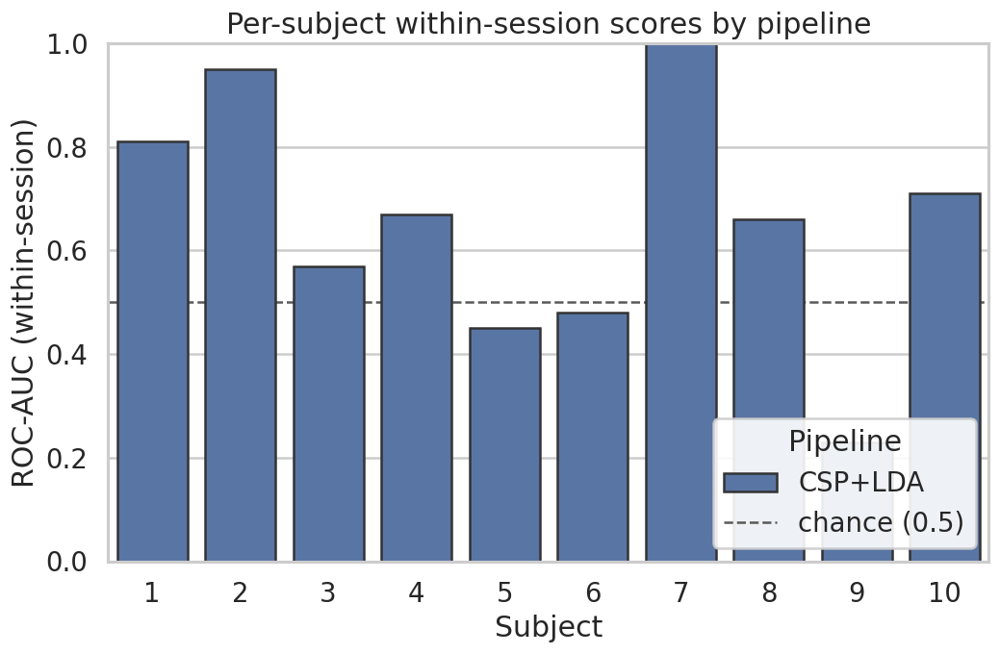
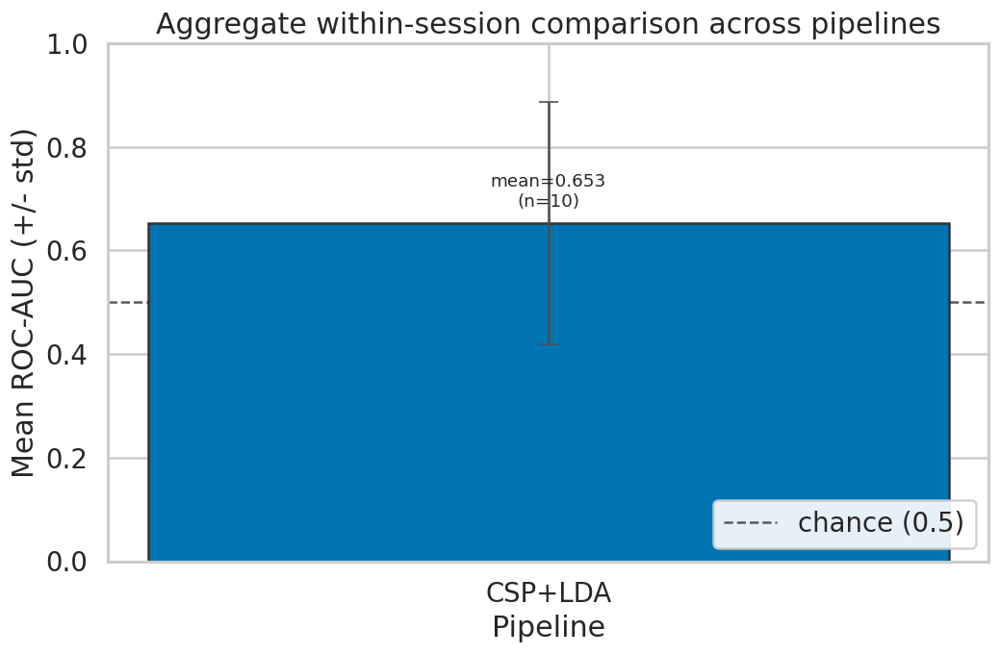
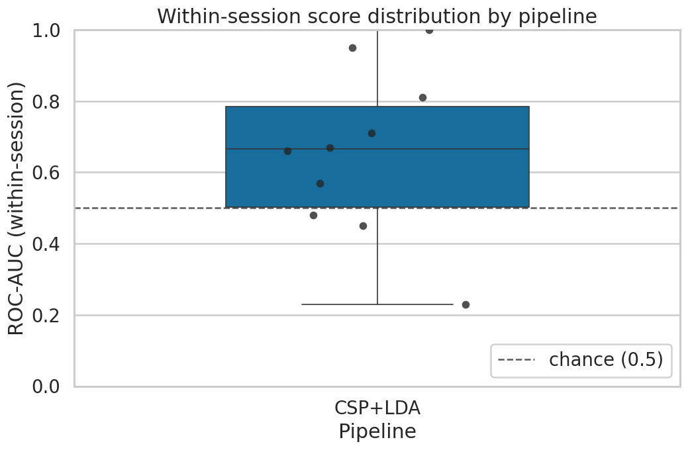

# BCI Motor Imagery Classifier

Reproducible EEG motor imagery classification using public BCI data, MOABB, and classical machine learning baselines.

This repository benchmarks left-hand vs right-hand motor imagery classification on the PhysionetMI dataset using a transparent evaluation protocol. The goal is to build a credible foundation for future BCI and neurotechnology work, not to claim a production-ready brain-computer interface.

> **Status: version 0.3 - within-session baseline with results and figures.**
> The dataset, pipeline, evaluation, result, and visualization modules are implemented. A within-session CSP+LDA benchmark has been run on PhysionetMI subjects 1-10 (`scripts/run_baseline.py`), and the aggregate summary table and figures have been generated from those results (`scripts/run_analysis.py`). The curated result tables (`results/baseline_results.csv`, `results/aggregate_scores.csv`) and figures (`figures/*.png`) are committed; raw EEG recordings and MOABB/MNE caches remain git-ignored and are never committed.

## Why This Project

Motor imagery classification is a classic Brain-Computer Interface (BCI) task: a model attempts to distinguish imagined movement classes from EEG signals.

This project focuses on doing that carefully:

- public dataset;
- established benchmark tooling;
- classical baselines first;
- per-subject results;
- explicit evaluation protocol;
- clear limitations.

## Dataset and Paradigm

Primary dataset:

- MOABB `PhysionetMI`.
- Source data: PhysioNet EEG Motor Movement/Imagery Dataset v1.0.0.
- 109 subjects, 1 session, 64 EEG channels, 160 Hz sampling rate, 3.0 s trials.
- Class labels in the dataset: `left_hand`, `right_hand`, `feet`, `hands`, `rest`.
- Dataset license: ODC-By 1.0 (separate from this repository's code license).

Primary paradigm:

- MOABB `LeftRightImagery`.
- Task: left-hand vs right-hand motor imagery (binary).
- Default frequency band: 8-32 Hz.
- Primary metric: ROC-AUC (binary chance level 0.5).

Raw EEG data and MOABB cache files are **not** stored in this repository (see `.gitignore`).

## Version 1 Scope

Version 1 uses a small, reproducible subject subset:

- Subjects: 1-10.
- Evaluation: within-session.
- Primary pipeline: CSP+LDA.
- Primary metric: ROC-AUC.

Version 1 is intentionally **not**:

- a deep learning benchmark;
- a real-time BCI;
- a clinical, diagnostic, or cognitive tool;
- a cross-user generalization claim;
- a production neurotechnology system.

## Pipelines

### CSP+LDA (primary)

Classical motor imagery baseline.

- CSP extracts supervised spatial features from EEG epochs (fit inside cross-validation to prevent leakage).
- LDA performs linear classification on the extracted features.
- A fixed, documented CSP component count is used as a baseline; it is **not** tuned on test results.

### Dummy / Chance Baseline (optional)

Sanity check against chance-level performance (~0.5 ROC-AUC).

### LogVariance+LDA (optional)

Simple feature baseline for comparison.

### Future Riemannian Baseline (deferred)

Optional later comparison using covariance-based methods.

## Evaluation Protocol

The benchmark is designed to report:

- per-subject scores;
- aggregate score summaries (mean, median, std, IQR, min, max, n_subjects);
- score variability;
- chance-level reference;
- pipeline comparison figures.

The first release uses within-session evaluation because the selected MOABB dataset snapshot has one session. Cross-subject evaluation is deferred and will be interpreted separately if added later. See `docs/evaluation_protocol.md` for the full protocol.

## Results (v0.3)

These results come from a single within-session MOABB run of the CSP+LDA pipeline on PhysionetMI subjects 1-10 (`LeftRightImagery`, 8-32 Hz, fixed random seed 42, ROC-AUC primary metric, CSP fit inside each cross-validation fold). They are reproducible via `scripts/run_baseline.py` followed by `scripts/run_analysis.py`.

Aggregate within-session ROC-AUC for CSP+LDA across the 10 subjects:

| pipeline | metric  | n_subjects | mean  | median | std   | IQR   | min  | max  |
|----------|---------|-----------:|------:|-------:|------:|------:|-----:|-----:|
| CSP+LDA  | roc_auc | 10         | 0.653 | 0.665  | 0.234 | 0.283 | 0.23 | 1.00 |

**Interpretation (cautious).** On the selected subjects, CSP+LDA performed above the binary chance-level ROC-AUC of 0.5 on average (mean 0.653, median 0.665), but scores varied substantially across subjects (from 0.23 to 1.00, std 0.234), and at least one subject fell below chance. These numbers should be read as a classical *within-session* baseline on a small subject subset, **not** as evidence of real-world, real-time, or cross-user BCI reliability, and they carry no clinical, diagnostic, or cognitive interpretation. The full per-subject table is in `results/baseline_results.csv` and the aggregate summary in `results/aggregate_scores.csv`.

Per-subject scores (chance level dashed at 0.5):



Aggregate comparison across pipelines (mean +/- std, chance at 0.5):



Score distribution across subjects (box plot with per-subject points, chance at 0.5):



## Repository Structure

```text
bci-motor-imagery-classifier/
  README.md
  LICENSE
  CITATION.md
  ROADMAP.md
  pyproject.toml
  requirements.txt
  .gitignore
  docs/                 # project, dataset, evaluation, model-card, limitations docs (local only)
  scripts/              # run_baseline.py (benchmark) and run_analysis.py (summary + figures)
  notebooks/            # planned benchmark + analysis notebooks
  reports/              # planned methodology/results report
  results/              # curated result CSVs committed; raw data ignored
  figures/              # curated figures committed; other outputs ignored
  src/bci_mi_classifier/  # implemented modules (config, datasets, pipelines, evaluation, results, visualization)
  tests/                # placeholder tests (pytest collection passes)
```

## Installation / Setup

Requires **Python 3.11+**.

```bash
# create and activate a virtual environment
python3 -m venv .venv
source .venv/bin/activate

# install runtime dependencies
pip install -r requirements.txt

# or install the package (editable) with dev tools (pytest)
pip install -e ".[dev]"
```

Core dependencies (planned): `moabb`, `mne`, `scikit-learn`, `pandas`, `numpy`, `matplotlib`, `seaborn`; `pytest` for development. See `requirements.txt` and `pyproject.toml`.

> Installing dependencies and running `scripts/run_baseline.py` will cause MOABB to download EEG data into a local cache on first use (this can take several minutes). That cache is git-ignored and must never be committed. The analysis step (`scripts/run_analysis.py`) only reads the saved result CSV and downloads nothing.

### Reproducing the results

```bash
# 1. run the within-session CSP+LDA benchmark (downloads data on first use)
python3 scripts/run_baseline.py

# 2. generate the aggregate summary table and figures from the saved results
python3 scripts/run_analysis.py
```

### Running the tests

The tests are currently placeholders that confirm collection works:

```bash
pytest
# or, to inspect collection only:
python -m pytest --collect-only -q
```

## Outputs

Generated and committed (curated, reproducible artifacts):

- `results/baseline_results.csv` - per-subject within-session results.
- `results/aggregate_scores.csv` - per-pipeline aggregate summary.
- `figures/per_subject_scores.png`
- `figures/pipeline_comparison.png`
- `figures/score_distribution.png`
- `scripts/run_baseline.py` - reproducible benchmark runner.
- `scripts/run_analysis.py` - aggregate summary + figure generation.

Planned for later versions:

- a short methodology/results/limitations report.

## What This Project Shows

- EEG motor imagery classification.
- BCI benchmark literacy.
- MOABB-based evaluation.
- Classical ML baselines.
- Careful interpretation of model scores.
- Reproducible AI / neurotechnology workflow.

## Limitations

- Version 1 uses only subjects 1-10.
- Within-session performance does **not** imply cross-user generalization.
- Scores can vary strongly by subject.
- No clinical, diagnostic, or cognitive interpretation is provided.
- No real-time BCI control is implemented.
- Deep learning is deferred until classical baselines are stable.

See `docs/limitations.md` for details.

## Roadmap

- Version 0.1: repository structure and documentation. (done)
- Version 0.2: first MOABB within-session CSP+LDA benchmark on subjects 1-10. (done)
- Version 0.3: result tables, aggregate summaries, and figures. (done, this release)
- Version 0.4: dummy and LogVariance+LDA baselines.
- Version 1.0: polished report, stable docs, GitHub-ready release.

Future: full 109-subject benchmark; cross-subject evaluation; Riemannian geometry pipeline; deep learning benchmark; real-time biosignal dashboard (separate project). See `ROADMAP.md`.

## License and Citation

This repository's code and documentation are released under the MIT License (see `LICENSE`). The underlying **dataset** is licensed separately under **ODC-By 1.0** and is not redistributed here. Please cite PhysioNet, the EEG Motor Movement/Imagery Dataset, MOABB, MNE-Python, and scikit-learn when using this work; see `CITATION.md`.

## References

- MOABB documentation: https://moabb.neurotechx.com/docs/index.html
- MOABB PhysionetMI: https://moabb.neurotechx.com/docs/generated/moabb.datasets.PhysionetMI.html
- MOABB LeftRightImagery: https://moabb.neurotechx.com/docs/generated/moabb.paradigms.LeftRightImagery.html
- MOABB evaluation concepts: https://moabb.neurotechx.com/docs/api.html
- PhysioNet EEG Motor Movement/Imagery Dataset: https://physionet.org/content/eegmmidb/1.0.0/
- MNE CSP: https://mne.tools/stable/generated/mne.decoding.CSP.html
- scikit-learn LDA: https://scikit-learn.org/stable/modules/generated/sklearn.discriminant_analysis.LinearDiscriminantAnalysis.html
